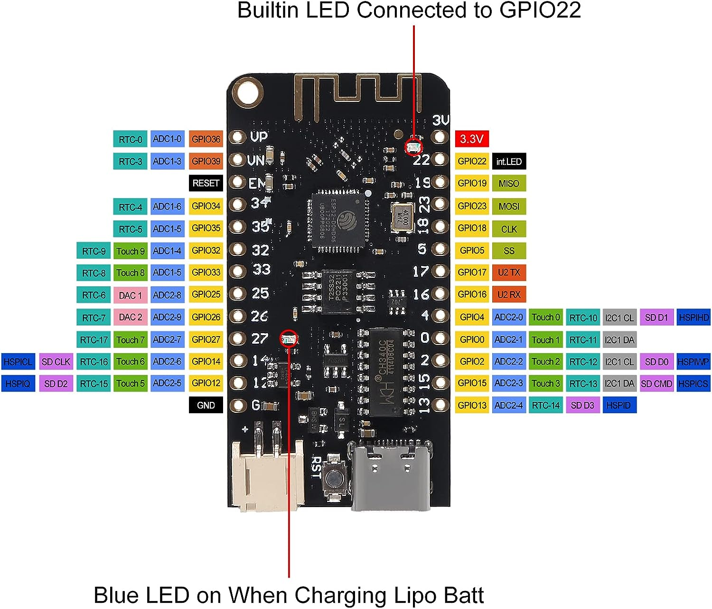

# ESP 32 Information and Debugging

https://stackoverflow.com/questions/76940998/powering-an-esp32-project-with-usb-c-and-a-lithium-ion-battery

 Aitrip Esp32 Lite

Use in Arduino IDE:
**WEMOS LOLIN 32Lite**

# Error verify code {"code":null}
https://www.reddit.com/r/arduino/comments/16xupbj/visual_studio_code_stopped_working_after_macos/

1. Go to System Settings
2. Go the the Privacy & Security section
3. Select the Full Disk Access option
4. Click the "+" button to add Visual Studio Code, or make sure the toggle is "On" if VSCode is already in the list.
5. Repeat the process for the Developer Tools and App Management sections within Privacy & Security section.

https://github.com/microsoft/vscode-arduino/issues/1681

might also need to redownload Arduino extension

# A fatal error occurred: The chip stopped responding.

> StopIteration
> 
> A fatal error occurred: The chip stopped responding.
> Error during Upload: Failed uploading: uploading error: exit status 2

> [!Solution]
> Drop Arduino Upload Speed to 115200 or less

